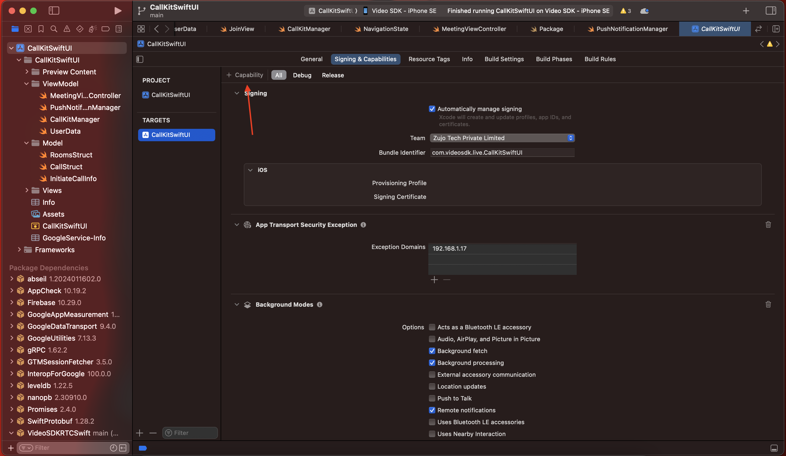

# iOS Call Trigger with VideoSDK

- Callkit enables you to display the system-calling UI for your app's VoIP services and manage communication between your app, the system, and other apps. [See for further details](https://developer.apple.com/documentation/callkit).

- Pushkit sends particular kinds of notifications, including notifications of file provider changes, watchOS complication updates, and VoIP invitations. It helps VoIP apps a lot. Visit [Pushkit](https://developer.apple.com/documentation/pushkit) for additional details.

### Step 1: Setup Firebase app

1.  Create Firebase iOS App within Firebase Project.
2.  Download and add `GoogleService-info.plist` file to project


### Step 2: Configure Pushkit

You must upload an APNs Auth Key in order to implement push notifications. We need the following details about your app when sending push notifications via an APNs Auth Key:

- Auth Key file
- Team ID
- Key ID
- Your app’s bundle ID

To create an APNs auth key, follow the steps below.

Visit the Apple [Developer Member Center](https://developer.apple.com/account/)


Click on `Certificates, Identifiers & Profiles`. Go to Keys from the left side. Create a new Auth Key by clicking on the plus button in the top right side.


On the following page, add a Key Name, and select APNs.


Click on the Register button.


You can download your auth key file from this page and upload this file to Firebase dashboard without changing its name.


In your firebase project, go to `Settings` and select the `Cloud Messaging` tab. Scroll down to `iOS app configuration`and click upload under `APNs Authentication Key`


Enter Key ID and Team ID. Key ID is in the file name, `AuthKey_{Key ID}.p8` and is 10 characters. Your Team ID is in the Apple Member Center under the [membership tab](https://developer.apple.com/account/#/membership) or displayed always under your account name in the top right corner.


### Note:

Enable Push Notifications in Capabilities




Enable selcted permission in Background Modes


## Server

You have to add `AuthKey_{Key ID}.p8` under server directory which we generated from Apple Dev and upload it to Firebase in client setup.
This will helps us in VoIP push notification.


Update KeyId and teamId in APN provider located inside `/initiate-call` API.


### Install dependencies and start server

```js
npm install
```

```js
npm run start
```

## Issues

You can generate the issue on [Github](https://github.com/videosdk-live/videosdk-rtc-ios-swiftui-call-trigger-example/issues) or ping us on [Discord](https://discord.gg/bsEukaNhrD)

## Other Information

### Tested on Devices

- iPhone SE (2nd Generation)
- iPhone 14
- iPhone xR

